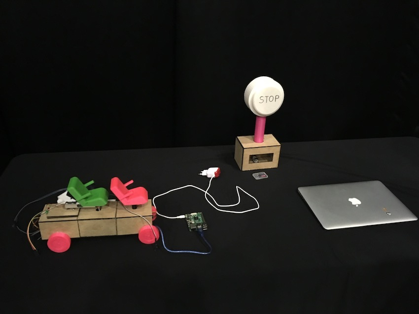

# Tour Bus Application

## Why We Built This?
Issues: 
1. There are few bus passengers who do not use seat belts
2. Missing the stops frequently happens to bus passengers
3. Want to know what's the best way to take photos at certain places

## How We Fixed the Problems? 
1. Let the passengers know when they get close to their destination through seat belt vibration
2. Encourage the passengers to fasten their seat belt. (If they don't, the application will be frozen and give an alert)
3. Give some tourist attractions and famous poses that are taken in the places(such as sitting down or jumping) using trained machine learning model 

## Notable Features
- Conducted image classification using Random Forests and 700+ photos to capture poses for attractions
- Sensors are located in the miniature bus, belt, and bus stop. They are intereacted to each other and give specific sensor values depends on the cases
- Prevented the access to certain pages without having specific requirements 
- Created the miniatures using 3D printer

| `Communication` | `Hardware` | `Software` | 
| --- | --- | --- | 
|  |  |  | 

## How It Works

- When the sensors of the stops and bus get closed, a certain signal goes to the backend server
- When the seat belts are fastened, the backend server will notice it and let the front sever know
- When the users set the destination, the information will be sent to the backend 
- Real-time communication between server and client happens using Socket.io

## Built With

* [Arduino](https://www.arduino.cc/) - Used to build hardwares 
* [React](https://reactjs.org/) - Used to build client side
* [Redux](http://redux.js.org/docs/basics/UsageWithReact.html) - Predictable state container for JavaScript apps
* [Node.js](https://nodejs.org/en/) - Used to build client side 
* [Express.js](http://expressjs.com/) - Framework for Node.js
* [MongoDB](https://www.mongodb.com/) - Used to build database 
* [mongoose.js](http://mongoosejs.com/) - MongoDB ODM for Node.js
* [axios](https://www.npmjs.com/package/axios) - Promise based HTTP client for the browser and node.js

## Authors

* ** Geon Yoon ** - * Frontend Development * - [GeonYoon](https://github.com/GeonYoon)
* ** JaeMoon Lee ** - * Backend Developmentk * - [JaeMoon Lee](https://github.com/ERTuringLee)
* ** TaeMin ** - * Hardware Development * 
* ** JeeYoon Lee ** - * Ideation & Presentation * 
* ** SooYoung Lee ** - * 3D Modeling * 

